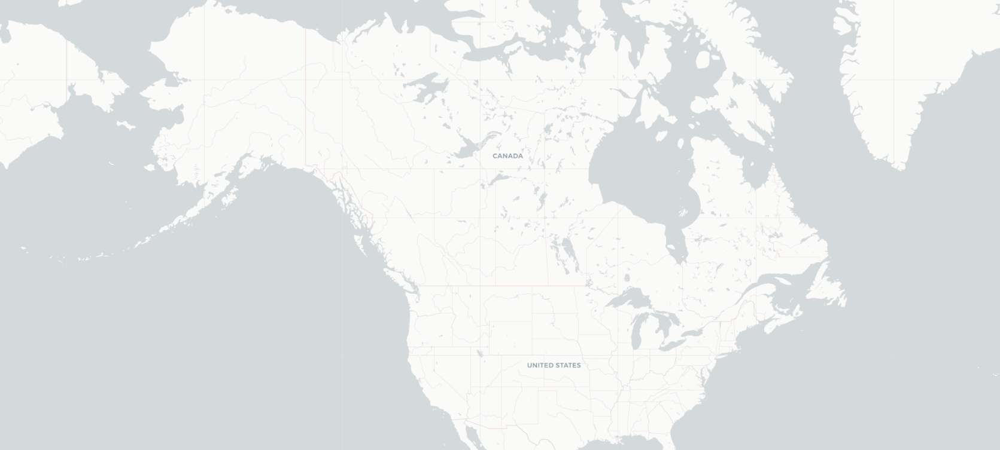
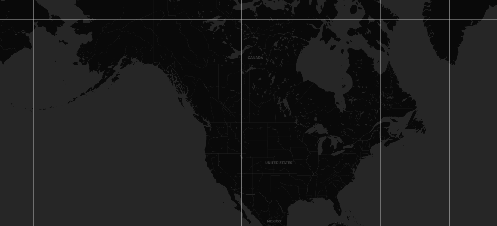
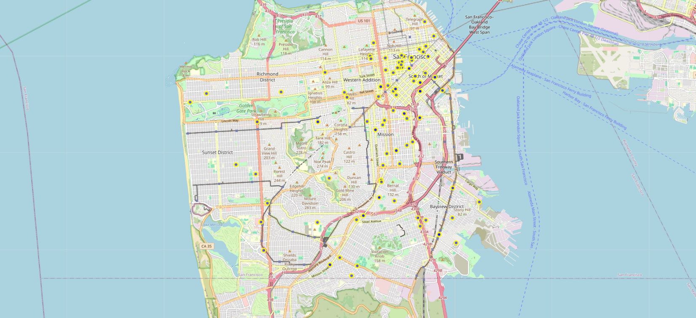
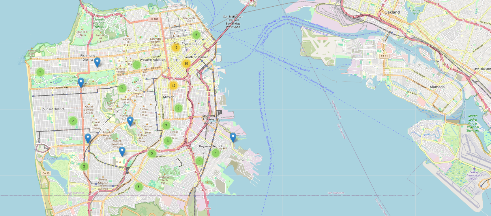
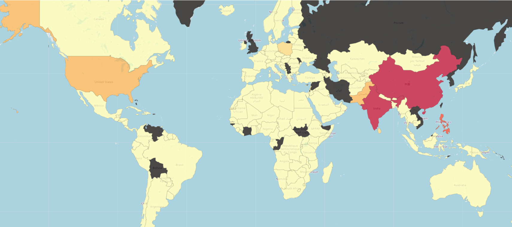

# interactive-maps-canada-immigration-analysis
Interactive geospatial data visualization project using Folium, analyzing immigration patterns to Canada with choropleth maps, marker clustering, and map styling.
# Geospatial Data Visualization: Canada Immigration Analysis

## Overview

How do you make complex geographic data understandable at a glance?

In this project, I explored geospatial data visualization using Python and Folium to analyze immigration patterns to Canada. The goal was not just to plot data on a map, but to progressively improve how that data is experienced — moving from raw, cluttered views to clear, interpretable insights.

This project demonstrates how visualization choices directly impact usability, clarity, and decision-making.

---

## The Problem

When visualizing large datasets on a map, a common issue quickly appears:

- Too many data points create visual clutter  
- Patterns become difficult to interpret  
- Users struggle to extract meaningful insights  

This project explores how different visualization techniques can address these challenges.

---

## Step 1: Establishing a Baseline

I began by exploring different map styles to understand how visual design affects readability.

### Light Map Style (CartoDB Positron)

### Dark Map Style (CartoDB Dark Matter)

These styles highlight how contrast, color, and background affect how users perceive geographic data.

---

## Step 2: Visualizing Raw Data (The Clutter Problem)

Next, I plotted individual data points representing incidents across San Francisco.

### Raw Markers (Unclustered)

At this stage:
- Each point is visible  
- But the map becomes visually overwhelming  
- Dense areas are hard to interpret  

This reflects a common real-world UX problem: **more data does not equal more clarity**.

---

## Step 3: Improving Usability with Clustering

To address the clutter, I implemented marker clustering.

### Marker Cluster Map

This significantly improves usability:

- Groups nearby data points into clusters  
- Reduces visual noise  
- Allows users to explore patterns at different zoom levels  

This is a clear example of how **interaction design improves data comprehension**.

---

## Step 4: Revealing Global Patterns with a Choropleth Map

Finally, I shifted from point-based visualization to aggregated geographic insights.

### Choropleth Map: Immigration to Canada

This visualization highlights:

- Geographic distribution of immigration  
- Regional patterns at a global scale  
- Relative intensity through color encoding  

This step transforms raw data into **high-level, decision-ready insight**.

---

## Key Insights

- Visualization choice directly impacts usability and clarity  
- Raw data can overwhelm users without thoughtful design  
- Clustering improves interaction and reduces cognitive load  
- Choropleth maps are effective for identifying macro-level geographic patterns  

---

## Tools & Technologies

- **Python**
- **Pandas** (data manipulation)
- **Folium** (interactive geospatial visualization)
- **GeoJSON** (geographic boundary data)
- **Jupyter Notebook (Google Colab)**

---

## Dataset

- Canada Immigration Dataset (1980–2013)
- San Francisco Police Incident Dataset

---

## What This Project Demonstrates

This project goes beyond basic plotting and demonstrates:

- Data → Visualization → Insight workflow  
- Geospatial reasoning and pattern recognition  
- UX thinking applied to data visualization  
- Progressive enhancement of data clarity  

---

## Next Steps

Potential improvements include:

- Adding interactive filters (by country, year, or category)  
- Enhancing tooltips for deeper data exploration  
- Building a dashboard-style interface for end users  

---

## Final Thought

Good data visualization isn’t just about displaying information — it’s about making complex data understandable, usable, and meaningful.

This project reflects that shift from simply showing data to **designing for understanding**.
